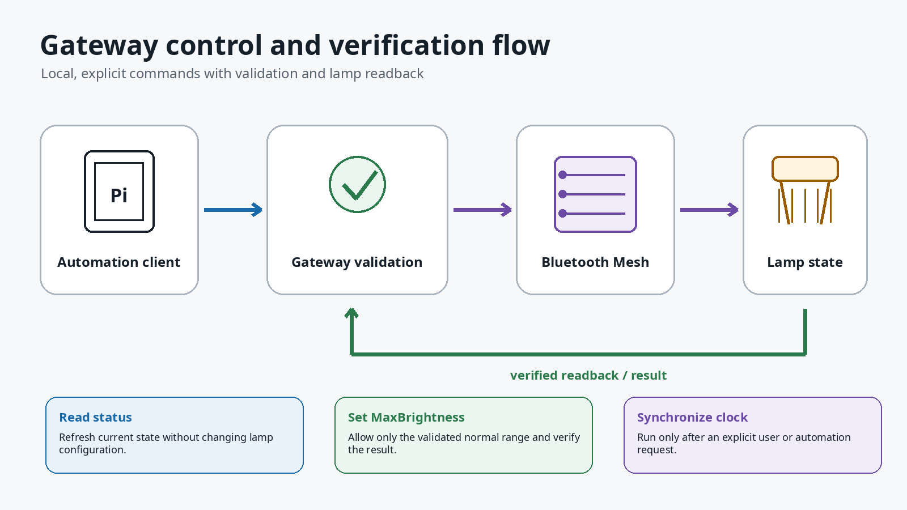

# SANlight Mesh BlueZ PoC

Minimal proof of concept for controlling SANlight Bluetooth Mesh dimmers from Linux/BlueZ.

Validated path:

- Raspberry Pi OS Lite 64-bit / Debian 13 `trixie`
- BlueZ `5.82`
- Raspberry Pi 3 internal Bluetooth controller `BCM43438`
- `bluetooth-meshd` started with raw HCI I/O: `--io generic:hci0`

The default/MGMT mesh I/O path was not reliable in the original tests: BlueZ reported `Mesh Send Complete`, but an external BLE scanner did not see Pi-originated Mesh `0x2A` / `0x2B` advertisements.

## Important

`private/SANlightMesh.json` is exported from the SANlight smartphone app and contains Bluetooth Mesh secrets. Never commit it, publish it, or paste it into issues.

## Minimal service installation

Install and start the BlueZ mesh daemon service:

```bash
sudo ./scripts/install-service.sh
```

For a fresh device or a deliberate development reset:

```bash
sudo ./scripts/install-service.sh --reset-mesh-state
```

Then run the CDB import/setup once:

```bash
sudo python3 sanlight_canonical_sender_poc.py --cdb private/SANlightMesh.json --iv-index 0 setup
```

Check logs with:

```bash
journalctl -u sanlight-meshd-generic.service -f
```

## Quick commands

After the daemon is running and `setup` has completed:

```bash
# Show addresses from your own CDB first
python3 sanlight_canonical_sender_poc.py --cdb private/SANlightMesh.json list-nodes

# Read a unicast lamp node from the list
sudo python3 sanlight_canonical_sender_poc.py --cdb private/SANlightMesh.json get-live <NODE>

# Set both detected SANlight lamp clocks to current local Pi time
sudo python3 sanlight_canonical_sender_poc.py --cdb private/SANlightMesh.json sync-now

# Set max brightness; 0 and 1..19 are rejected
sudo python3 sanlight_canonical_sender_poc.py --cdb private/SANlightMesh.json set-max <NODE> 68
```

Read `INSTRUCTIONS.md` for the full minimal setup.

## Visual overview

This overview image shows the basic setup: SANlight lamps with Bluetooth dimmers, a Raspberry Pi running the BlueZ/Python PoC, and the SANlight app view used as a reference for time and brightness behavior.


