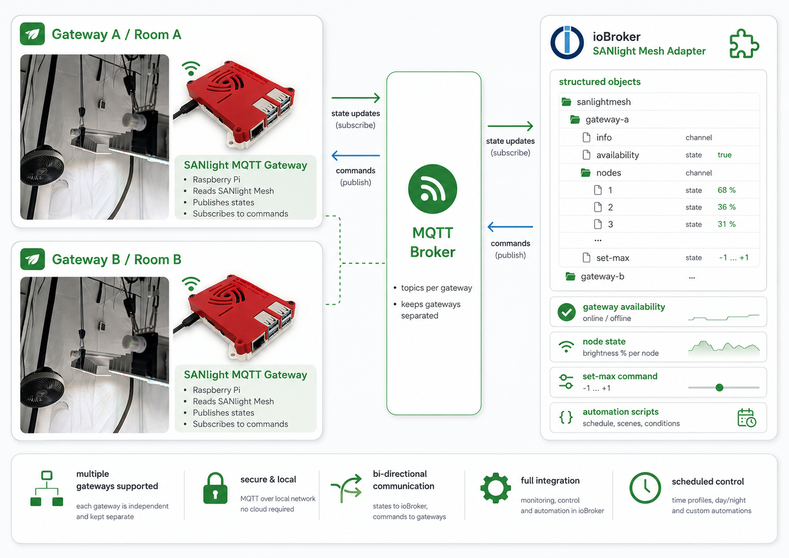

# SANlight Mesh MQTT Gateway

A local, community-built Bluetooth Mesh edge gateway for SANlight EVO dimmers. The gateway runs near the lamps, keeps all Mesh credentials local, and exposes a small versioned MQTT API for ioBroker or another automation system.

## Gateway-to-ioBroker architecture at a glance



*Each physical gateway or grow room remains independently identified and should be assigned to its own ioBroker adapter instance and broker ACL scope.*

The repository contains two operating paths:

- a hardened command-line engine for setup, diagnostics, recovery, clock handling, MaxBrightness control, blackout and restore;
- an always-on MQTT service that serializes commands and reuses the validated CLI transaction engine.

The companion native ioBroker adapter is developed separately in [`Nibbels/ioBroker.sanlightmesh`](https://github.com/Nibbels/ioBroker.sanlightmesh). The adapter never receives Mesh keys and never talks to BlueZ directly.

## Deployment model

The components may run on one host or on separate systems:

```text
SANlight lamps
      |
      | Bluetooth Mesh
      v
SANlight gateway Raspberry Pi
      |
      | MQTT
      v
Broker and ioBroker host
```

A split installation is the preferred design when the ioBroker host is too far away for reliable Bluetooth reception.

Each physical gateway or grow room should use its own `gateway.id`. The native ioBroker adapter intentionally manages exactly one configured gateway per adapter instance so lamps from separate rooms cannot be mixed accidentally. Multiple instances may use the same broker, provided each instance has a different gateway ID and ACL scope.

## Current validation status

| Area | Status |
|---|---|
| Raspberry Pi OS Lite 64-bit / Debian 13 `trixie` | hardware validated |
| BlueZ 5.82 with `bluetooth-meshd --io generic:hci0` | hardware validated |
| Read-only lamp status and MaxBrightness queries | hardware validated |
| Verified `set-max` with strict readback | hardware validated |
| Explicit blackout and protected restore | hardware validated |
| MQTT v1 gateway with Mosquitto | hardware validated |
| Generic ioBroker MQTT adapter integration | hardware validated |
| Native `ioBroker.sanlightmesh` adapter | initial implementation in separate repository |
| Interactive product installer and management helper | implemented, target-host validation still required |

The MQTT gateway was validated with two real SANlight nodes, service and broker restarts, retained-message safety, QoS 1 duplicate handling, TTL expiry, command coalescing, persistent rate limiting, blackout/restore and full Raspberry Pi reboot recovery.

This remains a pre-1.0 community project. Other SANlight firmware versions, Mesh layouts, brokers and network-security designs require their own validation. The low-maintenance distribution plan is a tagged release archive plus an idempotent installer; Debian packaging is deliberately not required.

> **Private data:** `private/SANlightMesh.json`, NetKey, AppKey, DeviceKey, MQTT passwords and local BlueZ state tokens must never be committed, published, pasted into issues or shared in logs.

## Start here

For a new lamp-side Raspberry Pi:

1. Follow **[SETUP.md](SETUP.md)** to create and validate the local BlueZ Mesh identities.
2. Verify one lamp with a read-only command.
3. Continue with **[INSTRUCTIONS.md](INSTRUCTIONS.md)** for CLI operation and recovery.
4. Install the always-on service using **[docs/MQTT_GATEWAY.md](docs/MQTT_GATEWAY.md)**.
5. After the Mesh setup is complete, the interactive deployment helper can create the MQTT config and install the service:

   ```bash
   sudo bash scripts/install-gateway.sh
   ```

The installer never changes lamp brightness or lamp time. It requires an already validated CDB and canonical sender state.

## Operations

After installation, use the read-only management helper:

```bash
sudo scripts/sanlight-gateway status
sudo scripts/sanlight-gateway doctor
sudo scripts/sanlight-gateway collect-diagnostics
```

The diagnostics bundle is intentionally redacted. Never attach the private CDB, password files or `.state/` contents to a support request.

## Documentation

- **[SETUP.md](SETUP.md)** — first-time BlueZ Mesh setup
- **[INSTRUCTIONS.md](INSTRUCTIONS.md)** — commands, maintenance and recovery
- **[docs/MQTT_GATEWAY.md](docs/MQTT_GATEWAY.md)** — validated MQTT gateway operation
- **[docs/MQTT_API.md](docs/MQTT_API.md)** — versioned MQTT v1 contract
- **[docs/ARCHITECTURE.md](docs/ARCHITECTURE.md)** — repository and deployment boundaries
- **[docs/INSTALLER.md](docs/INSTALLER.md)** — low-maintenance installation strategy
- **[docs/RELEASES.md](docs/RELEASES.md)** — release archive and update process
- **[docs/IOBROKER_INTEGRATION.md](docs/IOBROKER_INTEGRATION.md)** — generic and native ioBroker integration
- **[docs/MQTT_TEST_PLAN.md](docs/MQTT_TEST_PLAN.md)** — completed validation record and regression plan
- **[docs/CHATGPT_SUPPORT.md](docs/CHATGPT_SUPPORT.md)** — safe AI-assisted troubleshooting
- **[SECURITY.md](SECURITY.md)** — security model and reporting guidance
- **[CHANGELOG.md](CHANGELOG.md)** — release history and pending productization work
- **[AI_CONTEXT.md](AI_CONTEXT.md)** — maintainer and AI continuation context

> Unofficial community project. Not affiliated with or endorsed by SANlight GmbH.
