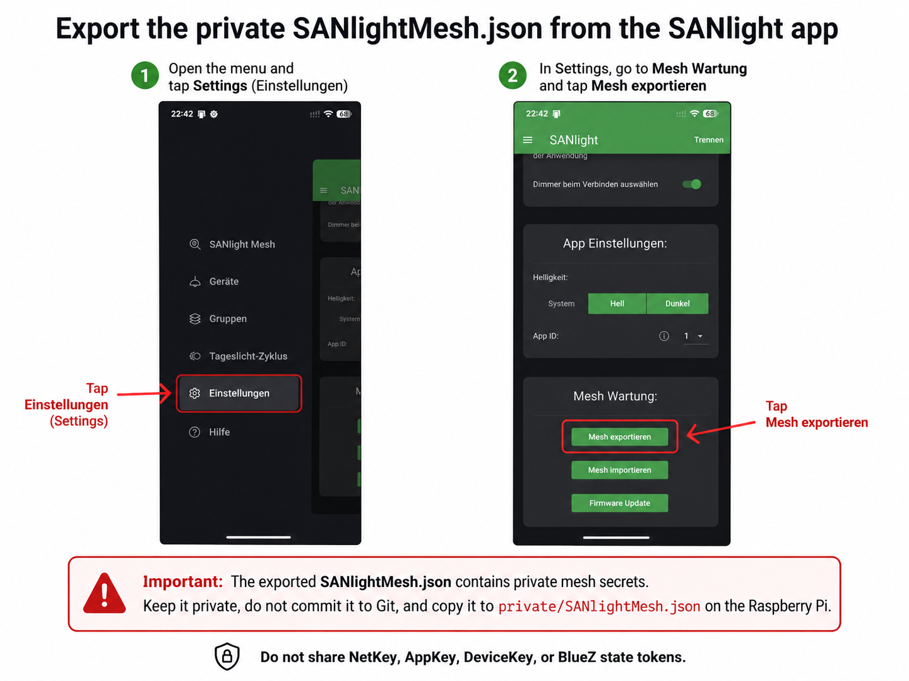

# End-to-end installation

This is the normal installation path for a clean **Raspberry Pi OS Lite 64-bit / Debian 13 trixie** gateway host and for an existing gateway whose protected project `.state/` is missing.

The deployment has two separate roles:

- the **broker/ioBroker host** runs Mosquitto and the ioBroker MQTT client;
- the **lamp-side gateway host** runs BlueZ Mesh and the SANlight MQTT gateway.

The gateway installer configures both local BlueZ identities and the always-on MQTT gateway. It does **not** install software on the remote broker host and does **not** change lamp time or brightness.

## 1. Prepare the external MQTT broker

The validated ioBroker integration uses Mosquitto on the ioBroker host. The ioBroker MQTT adapter runs in client/subscriber mode; it is not the broker in this setup.

Copy `scripts/install-mosquitto-broker.sh` from this repository to the broker/ioBroker host and run it there:

```bash
sudo bash install-mosquitto-broker.sh
```

The script:

- installs Mosquitto and its command-line clients;
- creates a password-authenticated listener on port `1883`;
- creates separate `sanlight-gateway` and `sanlight-iobroker` users;
- restricts both users to one `sanlightmesh/v1/<gateway-id>/...` namespace;
- rejects anonymous publication;
- restarts and verifies the broker.

Use this default setup only on a trusted private LAN. It does not configure TLS. Keep the two passwords available for the later gateway and ioBroker configuration.

The lamp-side gateway must use the broker host's LAN IP or DNS name. Do not enter `localhost` unless the broker actually runs on the gateway host.

Detailed broker behavior and update options are documented in [INSTRUCTIONS.md](INSTRUCTIONS.md). The ioBroker client settings are documented in [docs/IOBROKER_INTEGRATION.md](docs/IOBROKER_INTEGRATION.md).

## 2. Clone the repository on the gateway host

```bash
sudo apt update
sudo apt install -y git
git clone https://github.com/Nibbels/sanlight-mesh-mqtt-gateway.git
cd sanlight-mesh-mqtt-gateway
git switch main
git pull --ff-only
```

## 3. Copy the private SANlight export

Export the private Mesh file in the SANlight app and copy it to:

```text
private/SANlightMesh.json
```



Protect it:

```bash
mkdir -p private
chmod 700 private
chmod 600 private/SANlightMesh.json
```

Never publish this file. It contains Mesh keys and DeviceKeys.

## 4. Run the complete gateway installer

```bash
sudo bash scripts/install-gateway.sh
```

The wizard asks only for deployment-specific MQTT values: gateway ID, broker address, credentials, TLS choice and read-only refresh interval. Use the same gateway ID and the `sanlight-gateway` credentials created on the broker host.

App-ID 1, App-ID 2, repository path and the default `.state/` directory are internal invariants and are not normal prompts.

### IV Index handling

The installer accepts the IV Index from any mutually consistent trusted source:

- the private CDB;
- an existing validated BlueZ `node.json` identity;
- existing protected project state;
- an explicitly supplied `--iv-index` value.

If this is a genuinely fresh import and none of those sources contains the value, provide an independently verified value:

```bash
sudo bash scripts/install-gateway.sh --iv-index VERIFIED_IV_INDEX
```

Do not guess and do not assume `0` for another Mesh.

### Existing BlueZ identities with missing `.state/`

The installer preserves compatible existing BlueZ identities and reconstructs missing protected project state only after strict validation. It aborts instead of guessing when local state is incomplete or inconsistent.

The exact recovery rules are documented in [INSTRUCTIONS.md](INSTRUCTIONS.md).

## 5. Verify

```bash
sudo sanlight-gateway doctor
sudo sanlight-gateway status
```

List CDB-derived lamp addresses:

```bash
python3 sanlight_canonical_sender_poc.py \
    --cdb private/SANlightMesh.json \
    list-nodes
```

An explicit read-only lamp query remains available:

```bash
sudo python3 sanlight_canonical_sender_poc.py \
    --cdb private/SANlightMesh.json \
    get-live NODE_ADDRESS
```

Replace `NODE_ADDRESS` with a four-digit unicast address printed by `list-nodes`.

## Updates

Reuse the existing protected MQTT configuration and identity state:

```bash
git pull --ff-only
./scripts/run-tests.sh
sudo bash scripts/install-gateway.sh --reuse-existing
```

The normal gateway update path never resets Mesh state. Destructive reset options exist only in lower-level maintenance helpers documented in [INSTRUCTIONS.md](INSTRUCTIONS.md).
