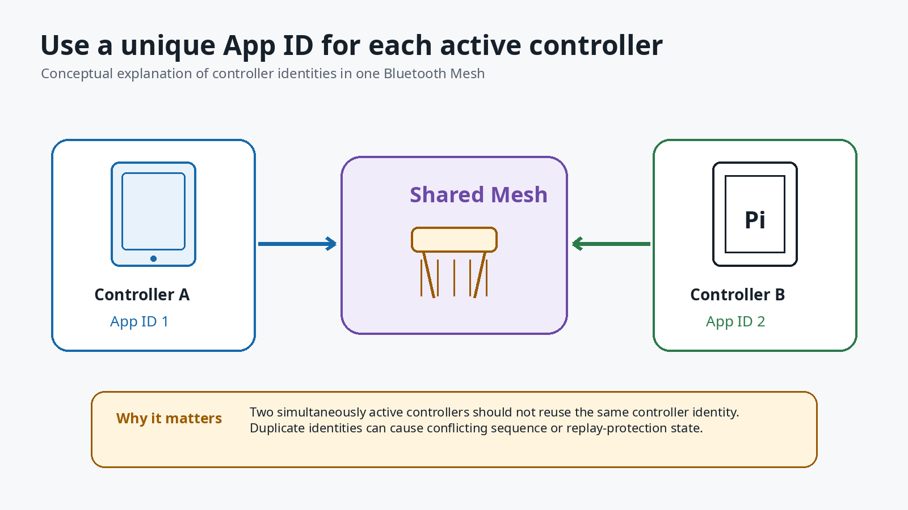

# Advanced gateway reference

This document preserves the complete identity, command, recovery and MQTT reference.
Normal installation starts in [SETUP.md](../SETUP.md); routine administration starts in [INSTRUCTIONS.md](../INSTRUCTIONS.md).

## Navigation

- [Identity and App-ID model](#scope-and-safety-model)
- [Installation behavior and IV Index recovery](#installation-behavior)
- [Local state and secrets](#local-state-and-secrets)
- [Read-only commands](#read-only-commands)
- [Traffic and Sequence Number budget](#traffic-frequency-and-sequence-number-budget)
- [Writing commands and blackout](#writing-commands)
- [Service operation and updates](#service-operation)
- [Troubleshooting and replay recovery](#troubleshooting)
- [Offline verification](#offline-verification)
- [MQTT gateway operation](#mqtt-gateway-operation)

## Scope and safety model

The project imports two local Bluetooth Mesh identities from nodes in the private SANlight CDB:

- control identity: `SANlight Provisioner 1`;
- canonical sender identity: `SANlight Provisioner 2`, with a SIG Configuration Client and the SANlight vendor model `0x0A8B/0x0001`.

In the validated export, these identities used unicast/source addresses `0x2400` and `0x2800` respectively. They are controller addresses, not lamp addresses. The addresses are read from `SANlightMesh.json` and must not be treated as universal constants.

### SANlight App-ID is not a Bluetooth Mesh AppKey index

The SANlight smartphone app has a proprietary setting named **App-ID**. Its own help text says that each device should use a different App-ID when the app is installed on multiple devices, because two devices using the same App-ID cannot both control the mesh.

In the tested mesh, the observed relationship was:

| SANlight app setting | CDB node identity | Mesh source address |
|---|---|---|
| App-ID 1 | `SANlight Provisioner 1` | `0x2400` |
| App-ID 2 | `SANlight Provisioner 2` | `0x2800` |

This is an observed mapping from the tested `SANlightMesh.json`, not a documented formula for every installation. Do not derive addresses for App-ID 3 through 16 or assume that every export contains the same identities. The CDB node name, UUID, DeviceKey and unicast address remain the source of truth.

The CLI option names `--control-app-id` and `--sender-app-id` are historical CDB identity selectors. Selector `0` means `nRF Mesh Provisioner`; selectors `1..15` mean `SANlight Provisioner N`. This does not mirror the app's visible `1..16` list exactly. The supported installer uses selectors 1 and 2 only; App-ID 16 and any further address mapping remain unvalidated.

In the tested setup, the phone app was configured for App-ID 1 and the gateway's proven command sender was the separate App-ID 2 / `0x2800` identity. Keeping them separate avoids a source-address and sequence-state collision. Only one active controller may use a particular local identity and its sequence state.

Do not confuse these terms:

- **SANlight App-ID:** app-side controller/provisioner identity selector;
- **Bluetooth Mesh AppKey index:** cryptographic application-key binding; the SANlight vendor model uses AppKey index `0` in this project;
- **Bluetooth Mesh AID:** a short identifier derived from an AppKey and carried in encrypted transport; it is not the SANlight App-ID;
- **lamp or group address:** the destination of a command, separate from the controller source address.

<p align="center">
  
</p>
<p align="center"><em>SANlight app help for the App-ID setting.</em></p>

The local setup configures BlueZ state, imports NetKey/AppKey material, binds Bluetooth Mesh AppKey index `0` to the sender vendor model and sets sender Default TTL 5. It does **not** send a lamp time or brightness command.

The `set-max` command has two independent range checks. Only integer values `20..100` are accepted. `0`, `1..19`, negative values and values above `100` are rejected before D-Bus and again while building the access PDU.

`0xFFFF` is always rejected. Destinations must exist in `SANlightMesh.json`; read and time commands require unicast lamp nodes where documented.

## Validated environment

- Raspberry Pi OS Lite 64-bit / Debian 13 `trixie`
- BlueZ `5.82`
- `bluetooth-meshd --io generic:hci0`
- exclusive use of `hci0` by the custom Mesh daemon
- Python 3 with `dbus` and `gi.repository.GLib`

Run the environment check:

```bash
sudo ./scripts/sanlight-env-check.sh
```

The unsupported-platform override exists for development only:

```bash
sudo ./scripts/sanlight-env-check.sh --allow-unsupported
```

## Installation behavior

The complete gateway installation performs these stages in order:

1. secure and semantically validate the CDB;
2. determine a mutually consistent IV Index from the CDB, exact matching BlueZ identity state or an explicit `--iv-index` value; protected project state is accepted only when it matches BlueZ;
3. install the validated BlueZ, Python, Paho MQTT, Mosquitto and diagnostic packages;
4. compile Python and run the offline safety suite;
5. verify trixie, 64-bit ARM, BlueZ 5.82, `hci0`, D-Bus and GLib;
6. safely adopt or import the control and canonical-sender identities;
7. install and start `sanlight-meshd-generic.service`;
8. create separate local-gateway and remote-ioBroker MQTT credentials;
9. configure an authenticated local Mosquitto broker with gateway-scoped ACLs;
10. generate the gateway TOML for `127.0.0.1:1883`;
11. install and start `sanlight-mqtt-gateway.service`;
12. print the ioBroker adapter settings and run read-only diagnostics.

The normal command is:

```bash
sudo bash scripts/install-gateway.sh
```

### Missing a trusted IV Index

A normal installation does not ask the user to choose an IV Index. Run the
installer without `--iv-index`. It resolves the value from trusted state in this
order:

1. an explicit `--iv-index`, when one was deliberately supplied;
2. the top-level CDB `ivIndex`, when present in `SANlightMesh.json`;
3. the `IVindex` stored by the exact matching control and sender BlueZ
   identities under `/var/lib/bluetooth/mesh`.

All available values must agree. Protected project `.state/*.json` files are not
an independent IV source: they are accepted only when they match the exact
corresponding BlueZ identity.

If all trusted sources are absent, the installer stops before any fresh identity
import. This normally means a completely new gateway was combined with an older
SANlight export that does not contain `ivIndex`, while no matching BlueZ database
was preserved.

Use this recovery order:

1. Export `SANlightMesh.json` again from a SANlight app currently connected to
   the mesh, replace `private/SANlightMesh.json`, and rerun the normal installer.
2. When migrating an existing gateway, preserve or restore the matching
   `/var/lib/bluetooth/mesh` databases and rerun the normal installer.
3. Only when the current network value has already been independently verified,
   pass it explicitly:

   ```bash
   sudo bash scripts/install-gateway.sh --iv-index VALUE
   ```

Decimal and conventional hexadecimal input are accepted, for example `0` and
`0x00000000`. These examples show the syntax; they are not universal defaults.

The repository maintainer's hardware-validation mesh was independently
established as IV Index `0`. A completely clean reinstall of that same mesh may
therefore use:

```bash
sudo bash scripts/install-gateway.sh --iv-index 0
```

Do not copy that value to a different mesh. The IV Index is network-wide replay
protection state and may have advanced through an IV Update.

No state is reset by default. The public installer deliberately has no
`--reset-mesh-state` option.

Lower-level maintenance helpers retain a destructive reset for a deliberate
complete local reinitialisation. It requires an independently verified IV Index
and is not an update command or a way to repair a missing `.state/` directory
when the matching BlueZ databases still exist. See **Destructive reset** below
before considering it.

## Local state and secrets

The following material is private:

- `private/SANlightMesh.json`
- NetKey, AppKey and every DeviceKey
- `.state/control-provisioner.json`
- `.state/canonical-sender.json`
- `.state/blackout-*.json` restore snapshots
- `.state/brightness-write-rate.json` safety state
- BlueZ Mesh database under `/var/lib/bluetooth/mesh`
- `/etc/sanlight-mesh-mqtt-gateway/mqtt-password.txt`
- `/etc/sanlight-mesh-mqtt-gateway/iobroker-mqtt-password.txt`
- `/etc/mosquitto/sanlight-mesh-mqtt-gateway.passwd`

The project state directory is mode `0700`; state files are atomically written with mode `0600`. Tokens are never printed during import or attach. A mode-`0600` runtime lock rejects concurrent commands that would compete for the same D-Bus object paths. The files are ignored by Git.

Check that no private file is staged:

```bash
git status --short
git check-ignore -v private/SANlightMesh.json .state/canonical-sender.json
```

## Read-only commands

List CDB-derived unicast and group addresses:

```bash
sudo python3 sanlight_canonical_sender_poc.py \
    --cdb private/SANlightMesh.json \
    list-nodes
```

The first column of the lamp table is named `NODE_ADDRESS`. It is the four-digit unicast address used by commands such as `get-live`. Addresses are installation-specific. Group addresses are listed separately and cannot be used by read-only node commands.

Read lamp time and the current effective-output field from one unicast lamp node:

```bash
sudo python3 sanlight_canonical_sender_poc.py \
    --cdb private/SANlightMesh.json \
    get-live NODE_ADDRESS
```

A valid six-byte `GetUptimeAndBrightness` status is decoded as:

```text
uint32 little-endian bytes 0..3 = lamp time in milliseconds
uint16 little-endian bytes 4..5 = current live brightness raw value
```

The CLI prints both the raw values and derived display fields, for example:

```text
lampTimeMs=61265168
lampClock=17:01:05.168
liveBrightnessRaw=461
liveBrightnessPercentEstimate=46.1%
```

`liveBrightnessRaw` is the authoritative decoded vendor value. The percentage
estimate is currently `raw / 10`, based on observed values and expected schedule
scaling behavior. This interpretation is not yet a calibrated measurement and
must not be presented as electrical watts, photons per second or PPFD.

This live value is different from `MaxBrightness`: MaxBrightness is the configured
scaling limit for the lamp's daily profile, while the live field indicates the
output level the lamp currently reports after its profile and scaling are applied.

Read the configured MaxBrightness percentage from one unicast lamp node:

```bash
sudo python3 sanlight_canonical_sender_poc.py \
    --cdb private/SANlightMesh.json \
    get-max NODE_ADDRESS
```

`get-max` sends SANlight GetMaxBrightness (`C8 8B 0A`) and requires a matching
status (`C9 8B 0A <PERCENT>`). It accepts only the requested source node, the
expected AppKey and a response addressed back to the canonical sender. The
status must contain exactly one byte in the reportable `0..100` range. `0` is
displayed as **off**; values `1..19` are preserved as unexpected diagnostics
instead of being silently discarded. A missing or malformed response is retried
once and never changes lamp state. The ordinary `set-max` command still rejects
`0` and accepts only `20..100`.

Read the Bluetooth Mesh Config Network Transmit setting from one unicast node:

```bash
sudo python3 sanlight_canonical_sender_poc.py \
    --cdb private/SANlightMesh.json \
    get-net-tx NODE_ADDRESS
```

Show the canonical sender's live non-secret BlueZ state after attaching it:

```bash
sudo python3 sanlight_canonical_sender_poc.py \
    --cdb private/SANlightMesh.json \
    show-sender-state
```

This prints only sender addresses, IV Index, IV Update flag, Sequence Number,
remaining 24-bit sequence space, and seconds since Mesh traffic was last heard.
It does not read `node.json` while the daemon is running and does not print keys
or state tokens. It also shows rough sequence-budget estimates for high-frequency
control.

## Traffic frequency and Sequence Number budget

Every **new outgoing Bluetooth Mesh message** from the canonical sender consumes
one value from its 24-bit Sequence Number space (`0..0xFFFFFF`, 16,777,216
values per IV Index). This includes read-only queries such as `get-max` and
`get-live`; read-only does not mean sequence-free. Network retransmissions of the
same PDU are handled by the Mesh stack, but each new application query or retry
is a new message.

A successfully verified unicast `set-max` uses the write and its
GetMaxBrightness readback, followed by one read-only live-status request for the
retained effective-output state. Retries can consume additional Sequence Numbers.
A normal MQTT refresh also performs both `get-max` and `get-live` for each target.
At one multi-message update every second, a 90-day cultivation run can therefore
exhaust the sender even without a software bug. The
Bluetooth SIG specifies IV Update as the standards-based way to obtain a fresh
sequence space, but this project does not initiate or automate a network-wide IV
Update. See the [Bluetooth Mesh Security Overview](https://www.bluetooth.com/wp-content/uploads/2025/04/MeshSecurityOverview_INFO_v1.0-1.pdf).

Project policy:

- use event-driven control and send only when the requested value meaningfully
  changes;
- do not poll `get-max` or `get-live` every second;
- for routine MaxBrightness automation, use **one minute or slower** unless a
  carefully reviewed use case requires otherwise;
- a one-minute verified update cadence over 90 days consumes roughly 388,800 to
  777,600 sequence values (about 2.3% to 4.6% of the full space);
- the CLI enforces a persistent **10-second minimum interval** between separate
  brightness-changing commands. This is an emergency guard against accidental
  tight loops, not a recommended control cadence;
- `--allow-fast-control` bypasses that guard and must only be used deliberately.

The lamp-side daily schedule should remain the primary fine-grained lighting
profile. Pi-side MaxBrightness control should adjust a coarse limit only when
there is a meaningful reason to do so.

## Writing commands

These commands intentionally change lamp state. They are never run by setup.

Set MaxBrightness for one CDB node or group:

```bash
sudo python3 sanlight_canonical_sender_poc.py \
    --cdb private/SANlightMesh.json \
    set-max DESTINATION_ADDRESS 68
```

For a unicast node, `set-max` uses two independent response layers:

1. It waits up to four seconds for a matching SANlight `0x07` acknowledgement.
   The acknowledgement counts only when source node, AppKey and response
   destination match the active transaction. If it is lost, the exact same
   idempotent value is sent one more time after a one-second delay.
2. Whether or not `0x07` was observed, the command then performs a read-only
   GetMaxBrightness query and compares the reported percentage with the
   requested value. A missing query response or a transient mismatch is queried
   once more. The write itself is never repeated because of a readback mismatch.

Successful unicast output ends with:

```text
SET-MAX VERIFIED. Node 0x1234 reports MaxBrightness 48% as requested.
```

The final exit status is:

- `0`: readback matched the requested percentage;
- `1`: local BlueZ/D-Bus failure;
- `2`: invalid command, destination or unsafe value;
- `3`: the write was sent but no valid readback could confirm it;
- `4`: the lamp replied with a valid but different MaxBrightness percentage on
  both readback attempts.

Exit code `3` does not prove that the write failed. Exit code `4` is a real
readback mismatch and must not be hidden by further automatic writes. Fully
closing and reconnecting the SANlight app remains a useful independent check;
the app may display a cached value until it reconnects.

A Mesh group write is sent only once. Responses from individual group members
cannot prove that every member applied the value, so group output is explicitly
reported as group-wide unconfirmed even when one or more statuses are observed.

### Explicit blackout and restoration

`set-max` intentionally never accepts zero. An intentional 0% output state uses
a separate, strongly confirmed command:

```bash
sudo python3 sanlight_canonical_sender_poc.py \
    --cdb private/SANlightMesh.json \
    blackout NODE_ADDRESS --confirm-blackout
```

Black out every detected SANlight lamp node individually:

```bash
sudo python3 sanlight_canonical_sender_poc.py \
    --cdb private/SANlightMesh.json \
    blackout all --confirm-blackout
```

Before sending any 0% command, `blackout` reads every selected node. It aborts
without writing when a current value cannot be read safely. It creates a
mode-`0600` restore snapshot under `.state/` containing **only nodes that this
invocation will actually change**, then sends 0% to those nodes and requires
`get-max = 0` from every changed node. Nodes that already report 0% are skipped
and are not added to the new snapshot. If every selected node is already off,
no write and no snapshot are created. The snapshot contains addresses and prior
percentages, not Mesh keys or state tokens. Keep it private because it still
describes the installation.

The blackout implementation serializes preflight reads, writes, acknowledgements,
and verification reads. Completed readback transactions invalidate their pending
timeouts before the next phase starts, preventing an old preflight retry from
overlapping a 0% write.

The official SANlight Bluetooth dimmer manual states that 0% (off) is supported
by EVO, EVO COMPACT, and STIXX dimmers, while Q-Series Gen2 dimmers have a 20%
minimum. `--confirm-blackout` means the operator has verified that the connected
dimmer series supports 0%. A blackout means zero commanded light output; it is
not electrical isolation from mains power. See the [SANlight Bluetooth Dimmer
manual](https://www.sanlight.com/wp-content/uploads/2023/03/sanlight-bt-dimmer-manual-2023-en.pdf).

Restore the newest snapshot:

```bash
sudo python3 sanlight_canonical_sender_poc.py \
    --cdb private/SANlightMesh.json \
    restore-blackout latest --confirm-restore
```

Or provide the exact protected snapshot path printed by `blackout`. Restoration
validates Mesh UUID, sender identity, CDB node membership, and every stored
percentage. It skips nodes that already match and verifies every value it writes.

Snapshots act as an undo stack. After a successful restore, the snapshot is
atomically marked completed but retained for audit. A later `restore-blackout
latest` selects the newest **active** snapshot instead of replaying one that was
already restored. Repeating `restore-blackout latest` therefore unwinds multiple
blackout operations in reverse order. An exact snapshot path can still be
reapplied deliberately; the CLI prints that it was previously completed.

This matters when blackouts overlap. Example: black out one node, then run
`blackout all`. The second snapshot contains only the other nodes that changed.
Restoring `latest` first undoes the second operation; running it again restores
that node from the earlier snapshot. Remove old snapshot files manually only
after the lamps have been independently checked.

Compatibility note: snapshots created by the older blackout implementation may
contain entries whose stored value is `0`. Those files are ambiguous undo steps
and are intentionally skipped by `restore-blackout latest`; they remain usable
only through an exact path. This prevents a legacy no-op snapshot from silently
turning a restored lamp off again.

A recent brightness write may trigger the 10-second safety guard. Wait for the
reported remaining interval. Use `--allow-fast-control` only for a deliberate
hardware test, not as normal automation.

Set one lamp clock to an explicit local clock value:

```bash
sudo python3 sanlight_canonical_sender_poc.py \
    --cdb private/SANlightMesh.json \
    set-time NODE_ADDRESS 10:38:30
```

Set all detected SANlight lamp nodes to an explicit clock value:

```bash
sudo python3 sanlight_canonical_sender_poc.py \
    --cdb private/SANlightMesh.json \
    set-time all 10:38:30
```

Synchronize all detected SANlight lamp clocks to Raspberry Pi local time:

```bash
sudo python3 sanlight_canonical_sender_poc.py \
    --cdb private/SANlightMesh.json \
    sync-now
```

Synchronize one node with an optional timing offset:

```bash
sudo python3 sanlight_canonical_sender_poc.py \
    --cdb private/SANlightMesh.json \
    sync-now NODE_ADDRESS --offset-ms 250
```

The Raspberry Pi timezone must be correct before `sync-now`:

```bash
timedatectl
sudo raspi-config
```

## Local MQTT broker and ioBroker connection

The normal product topology is self-contained on the lamp-side Raspberry Pi:

```text
SANlight lamps <-Bluetooth Mesh-> gateway Pi (this project)
                                   BlueZ + gateway + Mosquitto
                                                       ^
                                                       | trusted-LAN MQTT
                                                       |
                                                ioBroker adapter
```

`scripts/install-gateway.sh` installs and configures Mosquitto on the gateway Pi. The gateway client always uses `127.0.0.1:1883`. There is no second broker-host installer and no broker host, username, password or TLS prompt in the normal setup.

The installer creates:

```text
/etc/mosquitto/conf.d/sanlight-mesh-mqtt-gateway.conf
/etc/mosquitto/sanlight-mesh-mqtt-gateway.passwd
/etc/mosquitto/sanlight-mesh-mqtt-gateway.acl
/etc/sanlight-mesh-mqtt-gateway/mqtt-password.txt
/etc/sanlight-mesh-mqtt-gateway/iobroker-mqtt-password.txt
```

Anonymous access is disabled. Separate random users are generated for the local gateway and the remote ioBroker adapter. Each ACL is restricted to the exact `sanlightmesh/v1/<gateway-id>/...` namespace. Clear-text password files are root-only mode `0600`; the Mosquitto password database contains hashes and is group-readable only by the broker service.

The default listener is reachable through the Raspberry Pi's IPv4 LAN interfaces so that ioBroker can connect. Plain MQTT is intended only for a trusted private LAN or VLAN. Do not forward port `1883` from the internet. TLS, a shared broker or another broker host is an unsupported custom topology that requires deliberate code/configuration changes and separate validation.

Configure the native ioBroker adapter with:

- broker host: a stable LAN IP or hostname of the gateway Pi;
- broker port: `1883`;
- username and password printed/referenced by the installer;
- the exact gateway ID selected during installation.

One adapter instance manages one physical gateway. Multiple gateway Pis for separate SANlight Mesh installations are supported by creating multiple ioBroker adapter instances, for example `sanlightmesh.0`, `sanlightmesh.1` and `sanlightmesh.2`. Each instance connects to its corresponding gateway Pi and exact gateway ID; instances must not discover or combine all gateways through a wildcard subscription.

Detailed settings are in [docs/IOBROKER_INTEGRATION.md](IOBROKER_INTEGRATION.md).

## End-to-end installer and BlueZ identity-state adoption

The normal installation and upgrade command is:

    sudo bash scripts/install-gateway.sh

It installs the local Mosquitto broker, both persistent project services, all Mesh/MQTT dependencies and the protected MQTT configuration. `setup-all.sh`, `install-service.sh` and `install-mqtt-gateway.sh` are lower-level helpers rather than separate user-facing installation phases.

Existing BlueZ identities are adopted rather than re-imported. If the protected project state is missing while the matching CDB-derived BlueZ identity remains intact, the installer reconstructs the project state only after strict validation. Inconsistent or ambiguous state combinations abort without modifying the identity.

Before any `Network1.Import`, the installer stops the gateway and Mesh services and classifies each CDB identity independently:

| Protected project state | Exact CDB-derived BlueZ `node.json` | Action |
|---|---|---|
| present | present | validate identity, token and IV Index, then attach |
| missing | present | validate BlueZ state and reconstruct the project state atomically |
| missing | missing | permit a fresh import |
| present | missing | abort; automatic re-import is blocked |
| mismatch | mismatch | abort without printing private values |
| only `node.json.bak` | missing | abort for manual recovery |

The BlueZ path is derived strictly from the expected provisioner UUID. Recovery also requires the DeviceKey and unicast address to match the private CDB and all available IV Index sources to agree. The control and sender `node.json` structures may differ; the presence of `appKeys` is deliberately ignored and must never be used to select an identity.

Recovery reconstructs only `.state/control-provisioner.json` or `.state/canonical-sender.json` using the normal atomic mode-`0600` writer. It never changes `sequenceNumber`, copies AppKeys, or edits another BlueZ field.

For an update, keep all private Mesh state and run:

    git pull --ff-only
    ./scripts/run-tests.sh
    sudo bash scripts/install-gateway.sh --reuse-existing

A legacy config that points to the former external broker is migrated to the
local broker automatically. The gateway ID, CDB/state paths and refresh interval
are preserved, while new gateway/ioBroker MQTT credentials are generated. Use
the newly printed settings in the ioBroker adapter.

The lower-level `scripts/setup-all.sh` and `scripts/install-service.sh` helpers still support `--reset-mesh-state` for a deliberate complete local reinitialization. The option is intentionally destructive, is never implied by `scripts/install-gateway.sh`, and must not be used for routine updates or to recover a missing `.state/` directory while the corresponding BlueZ databases still exist.

## Reference end-to-end validation

The self-contained installation path was validated on real hardware on
2026-07-16:

- Raspberry Pi 3 with Debian 13 `trixie`, BlueZ 5.82 and internal `hci0`;
- local Mosquitto installed and configured by `install-gateway.sh`;
- two existing BlueZ identities with missing `.state/` safely adopted;
- 124 offline gateway tests and the static token-output scan passed on target;
- `sanlight-gateway doctor` reported every service and permission check healthy;
- native adapter installed on a separate Raspberry Pi 4 with Node.js 22.15.0;
- MQTT transport, gateway availability and protocol compatibility all true;
- a read-only refresh completed with status `verified`;
- nodes `0002` and `0003` were changed reversibly from 68% to 67%, verified by
  Mesh readback and independently visible in the SANlight app, then restored to
  68%.

The addresses, names and percentages above belong only to the reference
installation and are not defaults for another Mesh.

## Service operation

Complete read-only health check:

```bash
sudo sanlight-gateway doctor
```

The default installation has three persistent services:

```bash
systemctl is-active mosquitto.service
systemctl is-active sanlight-meshd-generic.service
systemctl is-active sanlight-mqtt-gateway.service
```

Status:

```bash
sudo systemctl status sanlight-meshd-generic.service
```

Recent logs:

```bash
sudo journalctl -u sanlight-meshd-generic.service -n 100 --no-pager
```

Follow logs:

```bash
sudo journalctl -fu sanlight-meshd-generic.service
```

Restart:

```bash
sudo systemctl restart sanlight-meshd-generic.service
```

Verify the D-Bus object:

```bash
busctl introspect org.bluez.mesh /org/bluez/mesh org.bluez.mesh.Network1
```

The service launcher discovers `rfkill` through `PATH`; it does not assume the incorrect `/usr/bin/rfkill` path. On Debian trixie, the package is installed by `setup-all.sh`.

## Updating the project

Use the merged `main` branch for installed systems and rerun the single product installer:

    git switch main
    git fetch --prune origin
    git pull --ff-only
    git status --short
    ./scripts/run-tests.sh
    sudo bash scripts/install-gateway.sh --reuse-existing

This refreshes the Mosquitto policy, both systemd units and the configured `project_root` while retaining the private CDB, BlueZ databases, protected project state and both MQTT credentials. The normal `scripts/install-gateway.sh` installation and update path never resets Mesh state. A destructive reset occurs only when `--reset-mesh-state` is explicitly supplied to one of the lower-level Mesh setup helpers documented above.

## Removing only the canonical sender

This removes the local App-ID-2 sender and its project state file. It does not reset lamps or the control identity:

```bash
sudo python3 sanlight_canonical_sender_poc.py \
    --cdb private/SANlightMesh.json \
    leave-sender
```

Run setup again to recreate it.

## Troubleshooting

### `rfkill: No such file or directory`

The revised setup installs the `rfkill` package and resolves the binary through `PATH`. Confirm:

```bash
command -v rfkill
```

Then reinstall the service:

```bash
sudo ./scripts/install-service.sh
```

### `org.bluez.mesh` is unavailable

Inspect service status and logs:

```bash
sudo systemctl status sanlight-meshd-generic.service
sudo journalctl -u sanlight-meshd-generic.service -n 100 --no-pager
```

Confirm that `hci0` exists:

```bash
ls -l /sys/class/bluetooth/hci0
rfkill list bluetooth
```

The installer disables the competing `bluetooth.service` and `bluetooth-mesh.service` because the validated `generic:hci0` path requires exclusive controller access.

### State identity mismatch

A state file belongs to a different CDB identity, App-ID or unicast address. Do not edit its token. On a disposable fresh installation, re-run the full setup with an explicit reset:

```bash
sudo bash ./scripts/setup-all.sh \
    --iv-index VERIFIED_IV_INDEX \
    --reset-mesh-state
```

### CDB has no `ivIndex`

This alone is not an error. The normal installer can still use the current value
from matching existing BlueZ identities. Do not supply `--iv-index` unless the
installer reports that every trusted source is absent.

When that error occurs, follow [Missing a trusted IV Index](#missing-a-trusted-iv-index).
Do not guess a value from the lamp addresses, SANlight App-ID, AppKey index,
Sequence Number or time since installation; none of those determines the IV
Index.

### Replay protection after a fresh SD card

Bluetooth Mesh uses a **24-bit Sequence Number** (`0..0xFFFFFF`) together with
the network-wide **32-bit IV Index**. The Sequence Number does not safely wrap
to zero. Before it is exhausted, a standards-compliant Mesh performs an IV
Update; after the network completes that procedure, nodes can use Sequence
Number zero again under the new IV Index. This project does not initiate IV
Update because that is a network-wide operation that has not yet been validated
against SANlight dimmers.

A fresh Raspberry Pi or deleted `/var/lib/bluetooth/mesh` state can recreate the
same canonical sender unicast address with a low Sequence Number. Lamps that
have already accepted higher values from that address may silently reject the
new messages as replayed traffic. Power-cycling a lamp is not a reliable fix: a
Mesh Replay Protection List is security state and is expected to survive power
cycles. Losing the SANlight lamp clock after power loss is unrelated.

Run the combined read-only diagnosis with one detected lamp node:

```bash
sudo bash ./scripts/diagnose-replay.sh NODE_ADDRESS
```

The script probes both identities and gives each path up to two attempts. It also
pauses briefly between the short-lived D-Bus application processes. A single
missing Config Status reply is **not** classified as replay protection because a
valid Bluetooth Mesh response can occasionally be lost or arrive outside the
10-second observation window.

Interpret the result only after the retries:

- control identity responds and canonical sender does not after both attempts:
  likely reused-sender replay state;
- both respond: sender sequence state is accepted;
- neither responds after both attempts: investigate RF, IV Index, keys, service,
  and controller ownership instead.

A negative result remains a strong diagnostic indication, not mathematical
proof. The script prints a restricted, non-secret summary of failed attempts so
that a transient timeout is visible before any recovery is considered.

The exact highest Sequence Number stored inside a lamp cannot be queried through
a standard Bluetooth Mesh model or read from an ordinary BLE advertisement. A
packet capture with Mesh keys can reveal the Sequence Number carried by a
specific transmitted Network PDU, but not the receiver's internal replay limit.
Do not expose Mesh keys merely to inspect this.

#### Explicit local sequence recovery

Only use this after the diagnostic reports that the control identity works while
the canonical sender does not. Recovery advances the local sender to an
**absolute minimum**; it never decrements or resets the value and never changes
lamp time or brightness. The tested recovery target for this project is
`0x100000`:

```bash
sudo python3 sanlight_canonical_sender_poc.py \
    --cdb private/SANlightMesh.json \
    recover-sequence \
    --minimum 0x100000 \
    --confirm-replay-recovery
```

The command:

1. requires root and the validated Mesh service to be active;
2. takes the exclusive project runtime lock;
3. stops `bluetooth-meshd` before reading or writing its database;
4. verifies the CDB sender UUID and unicast address;
5. creates a mode-`0600` backup under
   `/root/sanlight-mesh-sequence-backups`;
6. atomically advances `sequenceNumber` only when the existing value is lower;
7. restarts the service even when recovery fails.

The protocol maximum is `0xFFFFFF`, not a 32-bit or 64-bit counter. A value such
as `2^64 - 5` cannot be represented in a Bluetooth Mesh Network PDU, and the
recovery parser rejects it before any service or file is touched. Sequence Number
must never overflow to zero under the same IV Index. As an additional project
policy, recovery refuses targets above `0xBFFFFF`, leaving the final range
untouched for a proper IV Update or a Mesh rebuild. Repeating the same
`--minimum` does not add the value again; it is an absolute lower bound. Do not
keep guessing progressively larger targets: use the tested `0x100000` once, then
stop and investigate if the sender is still rejected. Never edit `node.json` while
`bluetooth-meshd` is running.

The protected backup contains the complete local BlueZ node database, including
private Mesh material. Do not display, copy into a chat, commit, or publish it.

After recovery, verify with:

```bash
sudo bash ./scripts/diagnose-replay.sh NODE_ADDRESS

sudo python3 sanlight_canonical_sender_poc.py \
    --cdb private/SANlightMesh.json \
    get-live NODE_ADDRESS
```

#### Destructive reset to a fresh sequence space

There is no safe local-only command that resets the same sender to Sequence
Number zero under the same IV Index while receivers retain their replay state.
The standards-based non-destructive solution is a proper network-wide IV Update.
If a broken or compromised sender has already caused receivers to remember
`0xFFFFFF`, no larger 24-bit value exists: local sequence advancement cannot
recover that condition. Stop the offending sender, then perform a coordinated IV
Update or rebuild the Mesh. This project deliberately does not fake an IV Index
change or wrap the counter.

Until IV Update is validated for SANlight, the final recovery path is to rebuild
the SANlight Mesh.

SANlight's official Bluetooth Dimmer manual documents a factory reset by holding
the **red side of the magnetic key** against the dimmer's flat surface for at
least **15 seconds**. The reset removes that dimmer from the SANlight Mesh; it
becomes visible again and cannot dim the lamp until paired. The app also offers a
reset while connected. See the official manual:

<https://www.sanlight.com/wp-content/uploads/2023/03/sanlight-bt-dimmer-manual-2023-en.pdf>

Resetting only one dimmer clears only that device's local state. It does not make
Sequence Number zero safe for other lamps that still remember the old sender.
For a complete fresh sequence space, reset and reprovision every lamp that has
accepted traffic from the reused sender, create/pair a new Mesh in the SANlight
app, export a new `SANlightMesh.json`, replace the private CDB on the Pi, and then
perform an explicit local BlueZ state reset during setup. This is destructive:
old groups, schedules, addresses, keys, CDB data, and Pi state are no longer
authoritative. Back up the existing SANlight export and local state before
starting. A normal lamp power cycle is not a factory reset.

Authoritative references:

- [Bluetooth Mesh Protocol specification](https://www.bluetooth.com/specifications/specs/mesh-protocol-1-1-1/)
- [Bluetooth Mesh Security Overview](https://www.bluetooth.com/wp-content/uploads/2025/04/MeshSecurityOverview_INFO_v1.0-1.pdf)
- [BlueZ Mesh D-Bus API](https://bluez.readthedocs.io/en/latest/mesh-api/)
- [SANlight Bluetooth Dimmer operating instructions](https://www.sanlight.com/wp-content/uploads/2023/03/sanlight-bt-dimmer-manual-2023-en.pdf)

### A command transmits but no status is received

Bluetooth Mesh status replies are not guaranteed. Check:

- lamp power and distance;
- that the destination is a detected unicast node;
- service logs for controller or advertising errors;
- repeated `get-live` results;
- Config Network Transmit using `get-net-tx`.

`get-live` performs two attempts with a ten-second response window each. A missing status is reported without inventing a result.

## Offline verification

Run all tests without Mesh hardware:

```bash
./scripts/run-tests.sh
```

The suite checks protocol bytes, brightness safety, CDB consistency, destination restrictions, state permissions and atomic writes, redacted output, CLI prevalidation, replay-diagnostic safety, 24-bit sequence bounds, forward-only recovery, protected backups, MQTT protocol validation, queue behavior, deduplication, retained-command policy and token-output patterns.

During the completed MQTT hardware validation on 2026-07-15, 97 tests passed on the target Linux host. The exact count may increase as regression coverage grows; passing the current suite is authoritative.

## MQTT gateway operation

The MQTT service is the normal product runtime. Keep this Raspberry Pi near the lamps when the ioBroker host is outside reliable Bluetooth range and run the merged service from `main`. The lamp-side Pi contains the private CDB, BlueZ state, local Mosquitto broker and gateway process; the ioBroker host needs only one native adapter instance per gateway Pi.

Configuration, installation and operation are documented in [docs/MQTT_GATEWAY.md](MQTT_GATEWAY.md). The versioned broker contract is in [docs/MQTT_API.md](MQTT_API.md), the completed hardware validation is in [docs/MQTT_TEST_PLAN.md](MQTT_TEST_PLAN.md), and the validated generic ioBroker path is in [docs/IOBROKER_INTEGRATION.md](IOBROKER_INTEGRATION.md).

The gateway keeps one MQTT connection and one serialized command queue. `bluetooth-meshd` remains persistent. Each queued command invokes the hardware-validated CLI transaction engine through a fixed argument vector; it never invokes a shell and MQTT cannot supply executable paths or arbitrary options.

The gateway implementation has been hardware validated for read-only refresh, verified set/restore, duplicate delivery, command expiry, retained-message rejection, offline retained-command suppression, coalescing, blackout/restore, persistent rate limiting, broker restart, gateway restart, full Raspberry Pi reboot and generic ioBroker operation.

Important automation rules:

- command topics are never retained;
- QoS 1 duplicates are deduplicated by command ID, including after gateway restart;
- every command has a creation time and short TTL;
- rapid pending `set-max` updates for one node are coalesced;
- cache-only no-op suppression is disabled by default because the SANlight app may also write;
- writes remain subject to the persistent ten-second guard;
- routine automation should normally update no faster than once per minute;
- periodic refresh defaults to 30 minutes and can be disabled;
- gateway logs are unbuffered under systemd and should appear immediately.

Do not map a per-second sensor loop or an un-debounced UI slider directly to Mesh commands. Read-only polling also consumes Sequence Numbers.
